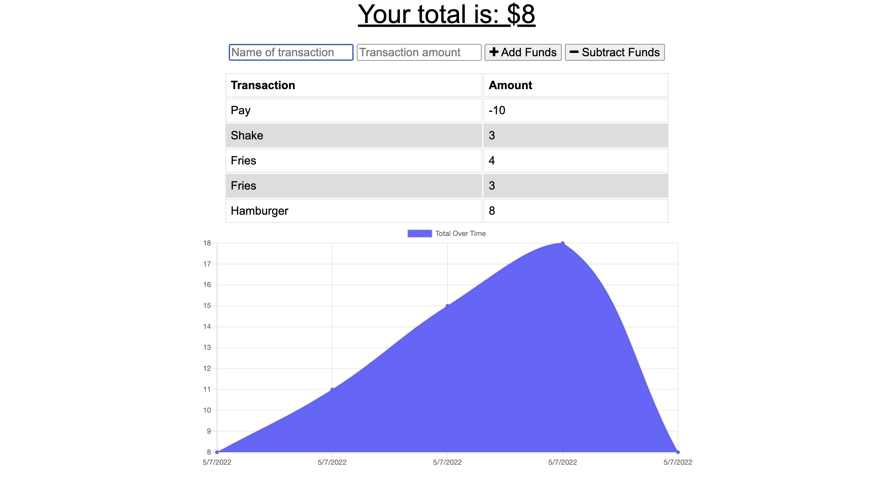

# [Welcome to Budget Tracker](https://murmuring-chamber-02433.herokuapp.com/)

#### The Budget Tracker is a Progressive Web App (PWA) that gives users a fast and easy way to track their money.

---

#### Collaborators:
* [Brian Swartz](https://github.com/bdswartz)

---

## Installation
N/A - 

---

## Usage
A user can use this app to track expenses over time.  Simply enter a name and an amount for the expense and it will update the chart showing expenses over time.

[Deployed Website](https://murmuring-chamber-02433.herokuapp.com/)
---

## Technologies

> <b>Development Tools:</b>
  * node.js
  * [Express.js](https://www.npmjs.com/package/express)
  * [MongoDB](https://www.mongodb.com/)
  * [Mongoose](https://mongoosejs.com/)
  * JavaScript

  ---

## User Story
### AS AN avid traveler
I WANT to be able to track my withdrawals and deposits with or without a data/internet connection
SO THAT my account balance is accurate when I am traveling 
    
### Acceptance Criteria for Minimum Viable Product

GIVEN a budget tracker without an internet connection
WHEN the user inputs an expense or deposit
    THEN they will receive a notification that they have added an expense or deposit
WHEN the user reestablishes an internet connection
    THEN the deposits or expenses added while they were offline are added to their transaction history and their totals are updated
    
---

## Features
-  Utilizes a Mongo database 
-  Uses express as the server.
-  In case of a slow or non-existent internet connection, all transactions are saved to the browser's IndexedDB and uploaded upon return of internet connection. 

---

## Questions
Please visit my GitHub page
at https://github.com/bdswartz

If there are any questions about the project,
feel free to open an issue or contact me at briandswartz@outlook.com